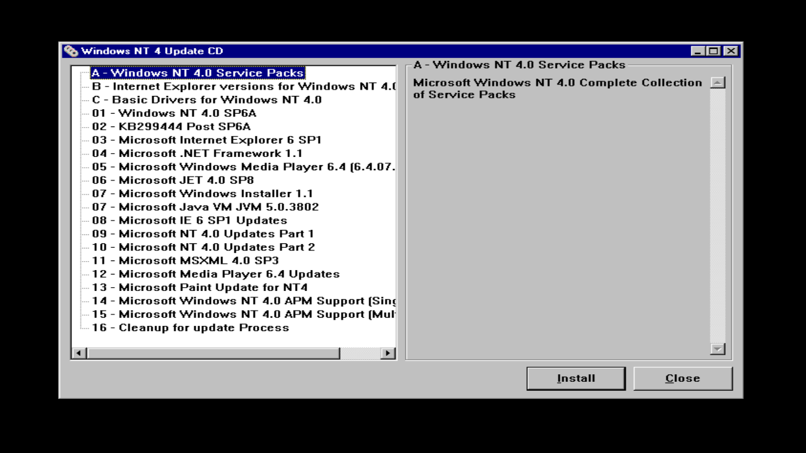

# Microsoft Windows NT 4.0 Updates, Fixes and Drivers 

Bringing NT 4.0 as upto date as possible.

Compiled list of Updates, Fixes & Drivers by us for Microsoft Windows NT 4.0.

# **Getting Started**

# **Always recommended to snapshot VM first!!!!**

Download the ISO and mount in the VM or burn to DVD.

ISO will autostart to menu.

# **Contents**

- [Updates](https://github.com/InstallingEverything/WindowsNT4Updates-Fixes/blob/main/Updates.md)
- [Service Packs](https://github.com/InstallingEverything/WindowsNT4Updates-Fixes/blob/main/SP.md)
- [Drivers](https://github.com/InstallingEverything/WindowsNT4Updates-Fixes/blob/main/Drivers.md) (Coming Soon)
- [Apps](https://github.com/InstallingEverything/WindowsNT4Updates-Fixes/blob/main/Apps.md)

# **Installing**

1. Follow the menu for install in order.
2. Internet Explorer installs on root of CD if needed or accessed via Menu.
3. Service Packs on root of CD if needed or accessed via Menu.

**Stats**

- 
- 
- 

    
Many thanks!

Installing Everything
