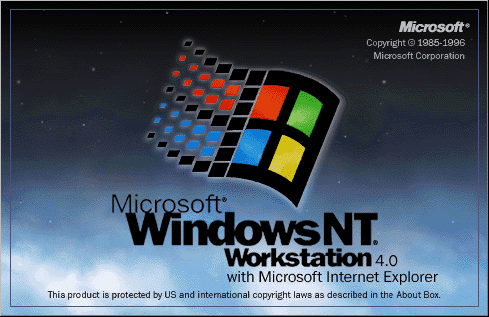

# Microsoft Windows NT 4.0 Updates, Fixes and Drivers 

Bringing NT 4.0 as upto date as possible.

Compiled list of Updates, Fixes & Drivers by us for Microsoft Windows NT 4.0.

# **Getting Started**

# **Always recommended to snapshot VM first!!!!**

Download the ISO and mount in the VM or burn to DVD.

ISO will autostart to menu.

# **Contents**

- [Updates](https://github.com/InstallingEverything/WindowsNT4Updates-Fixes/blob/main/Updates.md)
- [Drivers](https://github.com/InstallingEverything/WindowsNT4Updates-Fixes/blob/main/Drivers.md)
- [Apps](https://github.com/InstallingEverything/WindowsNT4Updates-Fixes/blob/main/Apps.md)

# **Installing**

1. NT4 Patches on root folder if needed.
2. Internet Explorer installs on root folder if needed.
3. Follow the menu for install in order.

**Stats**

- 

- 

    
Many thanks!

Installing Everything
