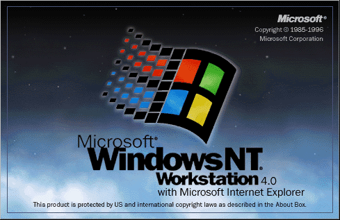
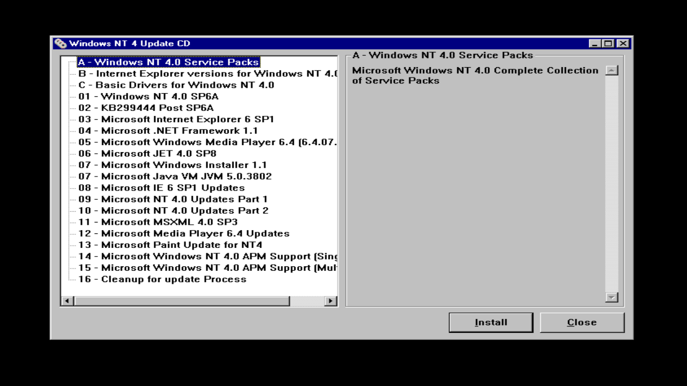

# Windows NT 4.0 Updates, Fixes & Drivers

A curated collection of updates, fixes, drivers, and applications for Microsoft Windows NT 4.0,
compiled to bring the OS as close to current as possible.

## Overview

This project provides a bootable ISO containing service packs, hotfixes, drivers, and
essential applications for Windows NT 4.0, primarily targeting virtual machine environments.

## Getting Started

> **Important:** It is strongly recommended to take a VM snapshot before proceeding.

1. Download the ISO from the [Releases](../../releases) page.
2. Mount it in your VM or burn it to a DVD.
3. The ISO will autostart and display an interactive menu.

## Installation

Follow the menu options in order. Items can also be accessed directly from the root of the disc:

- **Service Packs** — install before any other updates
- **Internet Explorer** — available on the root of the disc or via the menu

## Contents

| Section | Description |
|---|---|
| [Updates](Updates.md) | Hotfixes and patches |
| [Service Packs](SP.md) | Official Microsoft service packs |
| [Drivers](Drivers.md) | Hardware drivers (USB, audio, video) |
| [Apps](Apps.md) | Essential applications (.NET, IE, Media Player, etc.) |

## Compatibility

The included drivers have been tested with:

- VMware Workstation (all drivers supported, including SVGA II video)
- PCem and VirtualBox (audio and USB drivers only — video driver is VMware-specific)

## Stats

---

*Compiled and maintained by [Installing Everything](https://github.com/InstallingEverything).*
